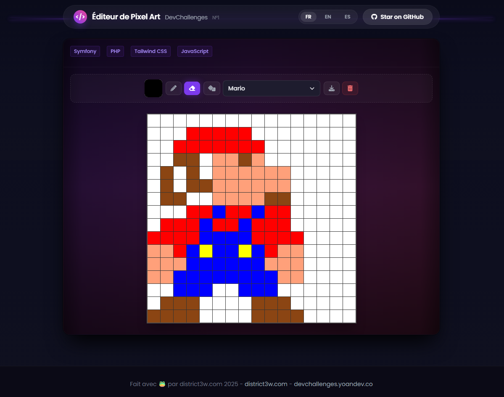

# 🎨 Pixel Art Editor - DevChallenges Week 47

Un éditeur de pixel art interactif 16x16 construit avec Symfony 7, Twig, Tailwind CSS et JavaScript vanilla. Ce projet répond au challenge [DevChallenges Week 47](https://devchallenges.yoandev.co/) avec un design moderne et sombre inspiré du site officiel.




## ✨ Fonctionnalités

### 🎯 Outils de dessin
- **Dessin** : Cliquez ou glissez pour peindre sur la grille
- **Sélecteur de couleur** : Choisissez n'importe quelle couleur avec le sélecteur natif du navigateur
- **Gomme** : Effacez les pixels avec animation d'explosion en petits pixels
- **Réinitialisation** : Videz toute la grille avec confirmation
- **Curseurs personnalisés** : Curseur crayon ✏️ en mode dessin, curseur gomme 🧹 en mode effacement
- **Animation d'effacement** : Effet visuel de pulvérisation lors de l'effacement d'une cellule colorée

### 💾 Persistance et Export
- **Sauvegarde automatique** : Les dessins sont automatiquement sauvegardés dans le `localStorage`
- **Restauration** : Votre œuvre est restaurée au rechargement de la page
- **Export PNG** : Exportez votre création en format PNG haute résolution
- **Export ICO** : Exportez votre création en format ICO pour créer des icônes
- **Export JSON** : Exportez votre création en format JSON (compatible avec les modèles)

### 🎨 Art prédéfini
- **Bibliothèque d'art** : 25 modèles de pixel art prédéfinis (Mario, Champignon, Cœur, Étoile, Chat, Maison, Arbre, Fleur, Fusée, Diamant, Papillon, Voiture, Poisson, Soleil, Lune, Nuage, Tasse, Pomme, Pacman, Fantôme, Bombe, Éclair, Flocon, Château)
- **Bouton aléatoire** : Chargez un art prédéfini au hasard
- **Menu déroulant** : Sélectionnez un art spécifique depuis la liste
- **Traductions** : Noms des modèles traduits en français, anglais et espagnol

### 🌍 Internationalisation
- Support multilingue (Français, Anglais, Espagnol)
- Changement de langue dynamique

### 🎨 Design moderne
- Interface sombre inspirée de DevChallenges
- Design responsive et moderne avec Tailwind CSS
- Animations fluides et transitions élégantes
- Effets de glassmorphism et gradients
- Logo DevChallenges personnalisé
- Notifications toast discrètes pour les sauvegardes

## 📋 Prérequis

- **PHP** 8.2 ou supérieur
- **Composer** 2.x
- **Node.js** 18+ et **npm** (pour Tailwind CSS)
- **Symfony CLI** (optionnel, mais recommandé)

## 🚀 Installation

### 1. Cloner le dépôt

```bash
git clone <votre-repo-url>
cd pixel-art
```

### 2. Installer les dépendances PHP

```bash
composer install
```

### 3. Installer les dépendances Node.js

```bash
npm install
```

### 4. Compiler les assets CSS

```bash
npm run build:css
```

Pour le développement avec recompilation automatique :

```bash
npm run watch:css
```

## 🏃 Exécution

### Démarrer le serveur de développement

```bash
# Avec Symfony CLI (recommandé)
symfony server:start

# Ou avec le serveur PHP intégré
php -S localhost:8000 -t public
```

### Accéder à l'application

Ouvrez votre navigateur à l'adresse : **http://localhost:8000**

## 🧪 Tests

Ce projet suit une approche **Test Driven Development (TDD)**. Tous les tests sont écrits avec PHPUnit.

### Exécuter les tests

```bash
php vendor/bin/phpunit
```

### Couverture des tests

Les tests couvrent :
- ✅ Rendu de la page principale
- ✅ Intégrité des données du service (structure Mario)
- ✅ Réponses de l'API (liste et récupération d'art)
- ✅ Gestion des erreurs

## 🏗️ Architecture

Le projet suit une architecture MVC avec Symfony :
- **Modèles** : Les pixel arts sont stockés en JSON dans `config/pixel_art/`
- **Services** : `ArtLibraryService` charge et met en cache les modèles
- **Contrôleurs** : `PixelArtController` pour l'interface, `ArtController` pour l'API REST
- **Vues** : Templates Twig avec JavaScript vanilla pour l'interactivité

Pour plus de détails sur le format des données et l'API, consultez [API.md](API.md).

## 📁 Structure du projet

Pour une description détaillée de l'organisation des fichiers et dossiers, consultez [STRUCTURE.md](STRUCTURE.md).

## 🎨 Stack technique

Pour la liste complète des technologies, frameworks et outils utilisés, consultez [STACK.md](STACK.md).

## 🌐 Internationalisation

Le projet supporte trois langues :
- 🇫🇷 Français (fr)
- 🇬🇧 Anglais (en)
- 🇪🇸 Espagnol (es)

Les traductions se trouvent dans `translations/`. Changez de langue via le sélecteur dans la barre de navigation.

## 🎯 Challenge DevChallenges

Ce projet répond aux exigences du challenge **Week 47 - Atelier Pixel Art** et va au-delà :

- ✅ Grille interactive 16x16
- ✅ Changement de couleur au clic et au glisser
- ✅ Sauvegarde dans `localStorage`
- ✅ Persistance au rechargement
- ✅ Design moderne et responsive
- ✅ 25 modèles de pixel art prédéfinis
- ✅ Export PNG, ICO et JSON
- ✅ Internationalisation (FR, EN, ES)
- ✅ Curseurs personnalisés selon l'outil (emojis ✏️🧹)
- ✅ Animation d'explosion lors de l'effacement
- ✅ Interface utilisateur intuitive avec icônes
- ✅ Architecture modulaire avec fichiers JSON pour les modèles

## 🤝 Contribuer

Les contributions sont les bienvenues ! Si vous souhaitez ajouter une nouvelle solution de défi ou améliorer une solution existante, veuillez consulter nos Directives de Contribution.

Veuillez noter que ce projet est publié avec un Code de Conduite. En participant à ce projet, vous acceptez de respecter ses termes.

## 📝 Licence

Ce projet est sous licence MIT. Voir le fichier `LICENSE` pour plus de détails.

## 👨‍💻 Auteur

Développé avec ❤️ et 🐸 pour le challenge DevChallenges Week 47

🌐 **Auteur** : [district3w.com](https://district3w.com)

## 🙏 Remerciements

- [DevChallenges](https://devchallenges.yoandev.co/) pour le challenge
- [Symfony](https://symfony.com/) pour le framework
- [Tailwind CSS](https://tailwindcss.com/) pour le framework CSS

## 📚 Ressources

### Documentation du projet

- [📡 Documentation API](API.md) - Documentation complète de l'API REST
- [📁 Structure du projet](STRUCTURE.md) - Organisation des fichiers et dossiers
- [🎨 Stack technique](STACK.md) - Technologies et outils utilisés
- [🤝 Guide de contribution](CONTRIBUTING.md) - Comment contribuer au projet
- [📋 Code de conduite](CODE_OF_CONDUCT.md) - Règles de comportement

### Documentation externe

- [Documentation Symfony](https://symfony.com/doc/current/index.html)
- [Documentation Tailwind CSS](https://tailwindcss.com/docs)
- [DevChallenges](https://devchallenges.yoandev.co/)

---

⭐ Si ce projet vous plaît, n'hésitez pas à lui donner une étoile !
